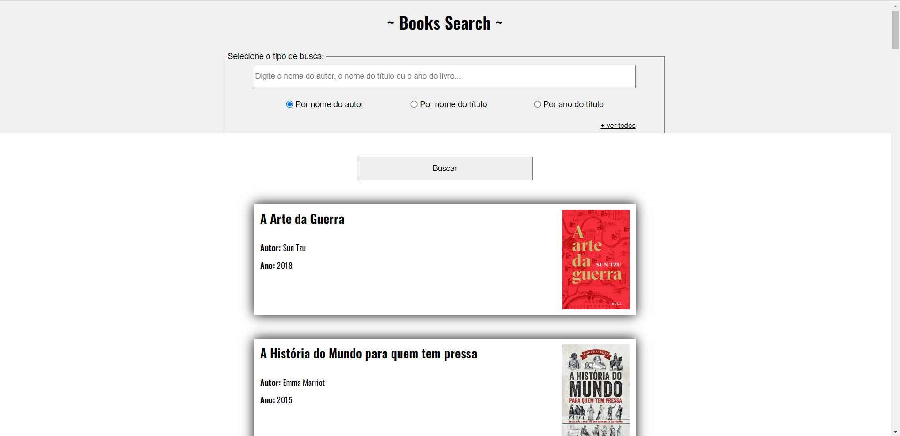

# ~ Books Search ~

  

## 📑 Description

Books Search was created to practice JavaScript methods, so a particular list of books was used for project development!

## 🔗 Functions

This project can be used as a tool to find information about books through three categories: author name, title name or year of publication.

## 💻 Language and Tools

For the development of this project, the following languages and tools were used:

- [HTML](https://developer.mozilla.org/pt-BR/docs/Web/HTML)
- [CSS](https://developer.mozilla.org/pt-BR/docs/Web/CSS)
- [JavaScript](https://developer.mozilla.org/pt-BR/docs/Web/JavaScript)

## 🚀 Deploy

Click on the link below to access the project 👇🏾

- [Books Search](https://hrodrigomota.github.io/books-search/)
